# Olá, eu sou Matheus Henrique F. Perassoli 👋

🎓 Estudante de Engenharia de Software.

💻 Apaixonado por tecnologia, desenvolvimento de software e inovação.

## 📊 Estatísticas do GitHub

  
  

## 📬 Contato

  
  
  

## 💻 Tecnologias

  
  
  
  

## 🐍 Minhas contribuições

<picture>
  <source
    media="(prefers-color-scheme: dark)"
    srcset="./profile/snake-dark.svg"
  />
  
</picture>